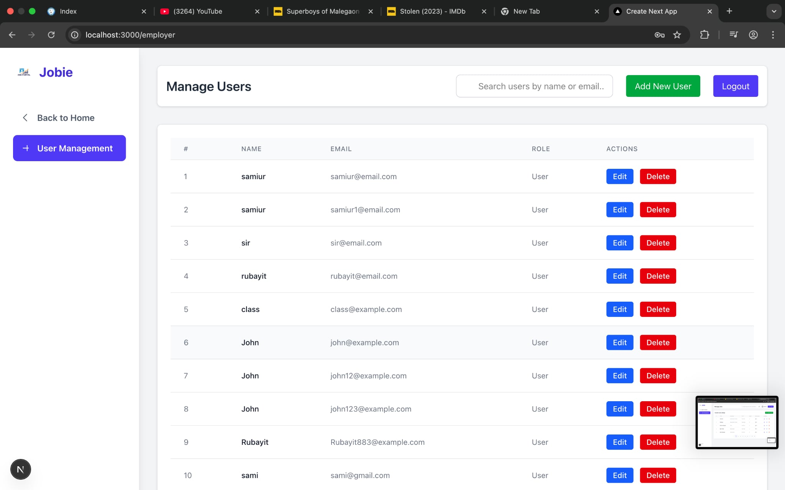
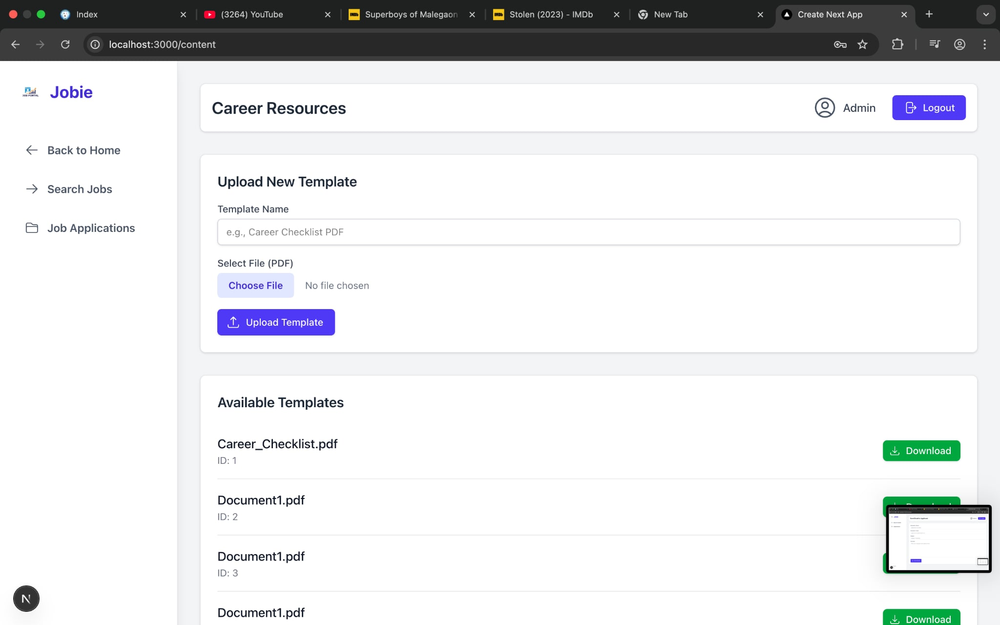
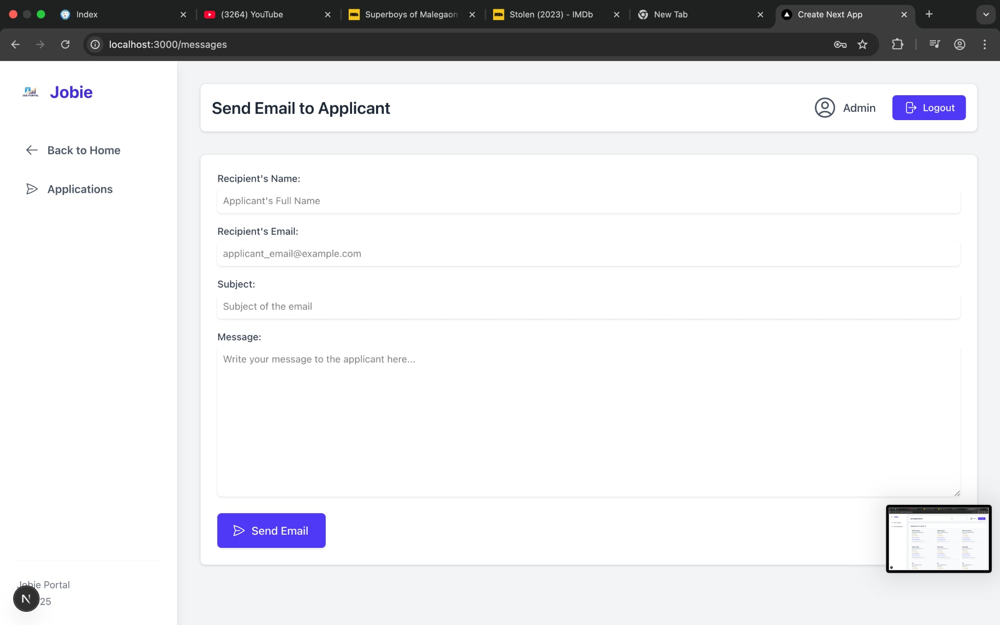
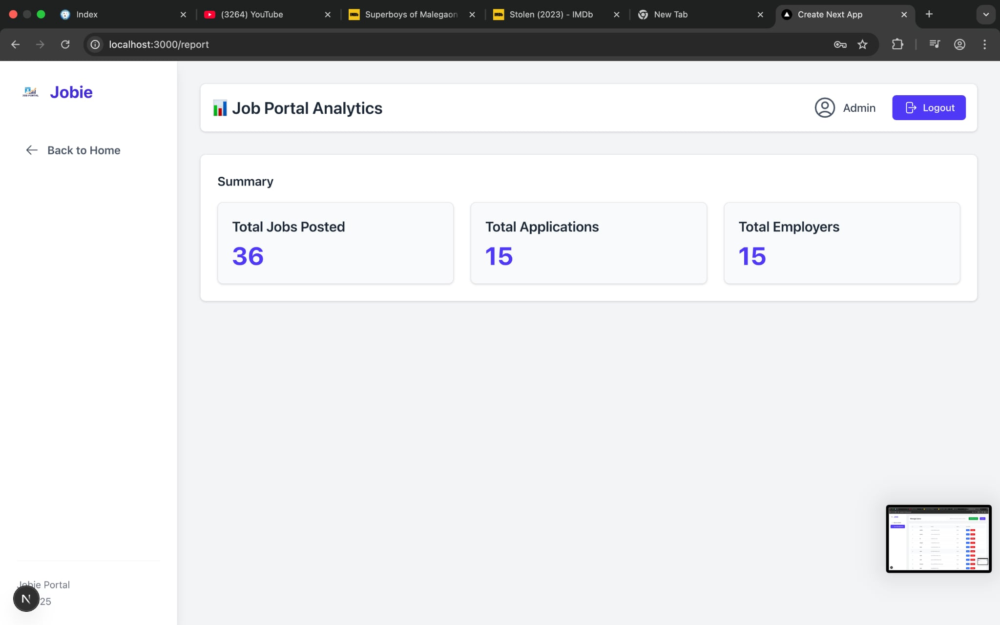

# Job-Portal
Fullstack job posting and application system with user authentication, role management, and admin controls
This full-stack web application for job posting and application management, built with Next.js, React, Tailwind CSS, Node.js, NestJS, and PostgreSQL.

## Features

- **User Authentication:** Secure sign up, login, and session management.  
- **Role Management:** Admin, Employer, and Candidate roles with access control.  
- **Job Management:** Post, edit, and delete jobs.  
- **Job Applications:** Apply to jobs and manage applications.  
- **Job Search:** Search jobs by keyword, category, or location.  
- **Career Resources:** Upload and download career resources (PDFs, documents).  
- **Resume Management:** Employers/Admins can view resumes of job seekers and send emails to them.  
- **Email Notifications:** Notify users about application status and new jobs.  
- **Admin Dashboard:** Manage users, jobs, applications, resources, and view reports.  
- **Responsive UI:** Modern, mobile-friendly interface.

---

## Tech Stack

- **Frontend:** Next.js, React, Tailwind CSS  
- **Backend:** Node.js, NestJS  
- **Database:** PostgreSQL  
- **Authentication:** JWT (JSON Web Tokens)  
- **Email:** SMTP  

---

---

## Screenshots

---

## API Endpoints 

- `POST /api/auth/register` – Register a new user  
- `POST /api/auth/login` – Login  
- `GET /api/jobs` – List all jobs  
- `POST /api/jobs` – Create a new job (Employer/Admin)  
- `GET /api/applications` – List all applications (Admin/Employer)  
- `POST /api/applications` – Apply to a job  
- `GET /api/search` – Search jobs by keyword, category, or location  
- `POST /api/resources` – Upload career resources  
- `GET /api/resources` – Download career resources  
- `GET /api/resumes` – View resumes of job seekers (Admin/Employer)  
- `POST /api/email` – Send email to job seekers  
- ...and more

---

